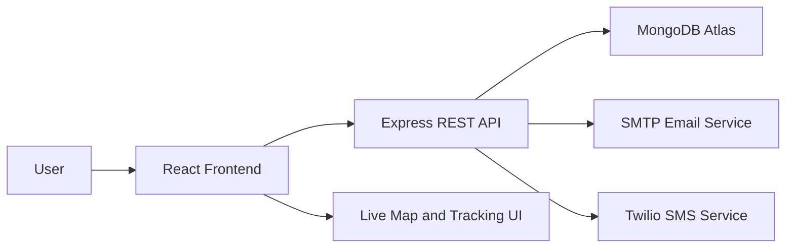
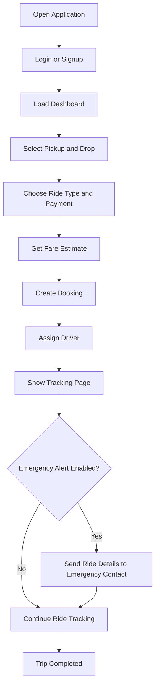
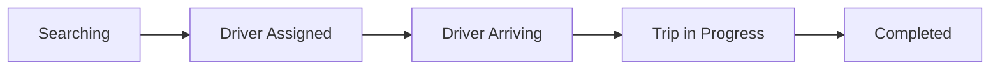
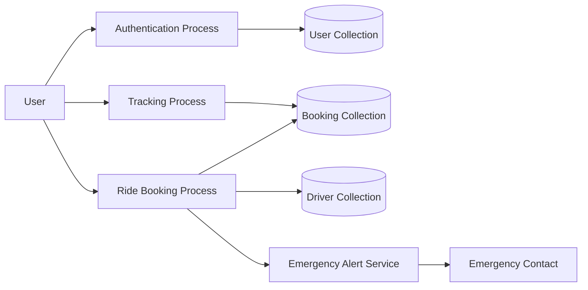
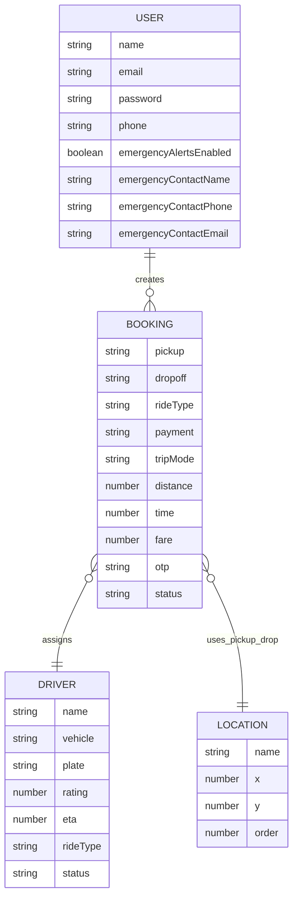
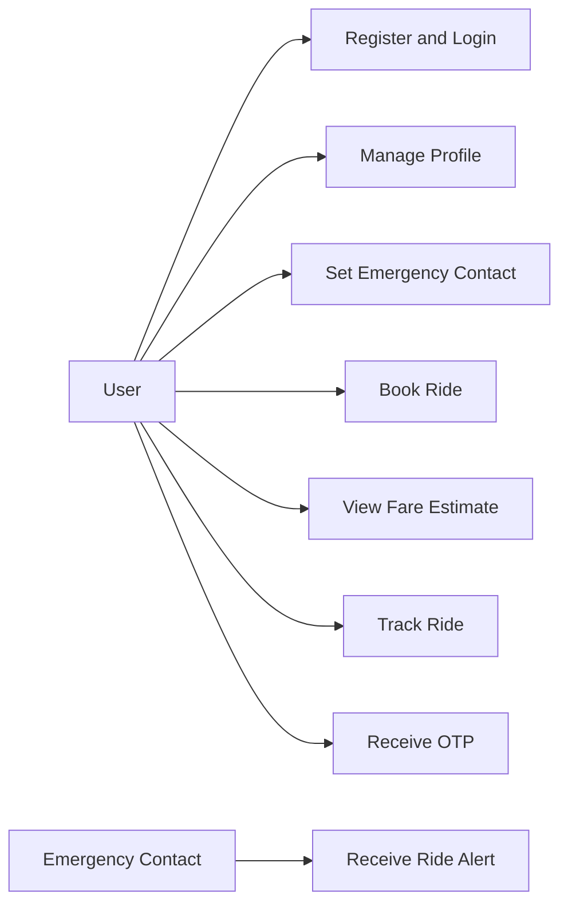

# RYDO - RIDE BOOKING AND SAFETY ALERT SYSTEM

**Department of Computer Science and Engineering (CSE Core), Parul Institute of Technology**  
**Minor Project Report**

**Presented By:** Kuldeep Ravindra Patil  
**Mentor:** Mr. Tadikonda Venkatata Durga Prasad

**Project Links**
- GitHub Repository: https://github.com/kuldeeppatil2911/Rydo_project
- Live Application: https://client-omega-five-23.vercel.app
- Live API: https://rydo-api-service-production.up.railway.app/api/health

## Abstract
Rydo is a web-based ride booking and safety alert system developed using the MERN stack. The project is designed to provide a simple, user-friendly, and safety-focused platform where users can sign up, log in, book rides, view fare estimates, track ride progress, and maintain emergency contact details. The system includes a special safety feature through which ride details such as pickup point, drop-off point, driver name, vehicle number, fare, payment mode, and OTP can be shared with the user's emergency contact through email or SMS when the feature is enabled.

The application uses React and Vite for the frontend, Node.js and Express.js for backend services, and MongoDB Atlas for cloud-based data storage. It also supports live map display for current location and a driver movement simulation to improve the ride tracking experience. The project demonstrates modern web development concepts such as REST APIs, JWT authentication, modular design, database integration, and cloud deployment. Rydo is suitable as an academic minor project because it combines practical problem solving with full-stack software development.

---

# CHAPTER 1
# INTRODUCTION

## 1.1 Overview
With the growth of digital services, ride-booking systems have become an important part of daily transportation. Users expect a platform where they can quickly log in, select pickup and drop locations, see ride estimates, confirm a ride, and track the journey in real time. However, many simple academic ride-booking projects only focus on the booking part and ignore user safety features.

Rydo is developed to address this need by combining ride booking with an emergency alert mechanism. The project provides a smooth ride-booking flow and also gives users the ability to add emergency contact details in their profile. When a ride is booked, the system can notify the trusted contact with the most important ride information. This makes the project more meaningful and closer to real-world requirements.

The application is developed as a modern full-stack web solution using MongoDB, Express.js, React.js, and Node.js. It is cloud-deployed, user-friendly, and structured in a modular manner for easy understanding and future enhancement.

## 1.2 Problem Statement
In many basic ride-booking demo systems, the focus remains limited to booking and fare calculation. Important concerns such as user safety, emergency communication, and transparent ride tracking are often missing. A user may need a trusted person to know ride details while traveling, especially for safety purposes.

The major problems that motivate this project are:
- lack of a simple ride-booking platform suitable for academic demonstration
- absence of emergency contact alert functionality in basic demo systems
- limited ride tracking and live-status visibility
- no centralized way to combine booking, tracking, and safety features in one workflow
- difficulty in demonstrating real full-stack deployment in a minor project

Therefore, there is a need for a web-based ride-booking application that provides secure login, booking, tracking, and emergency communication in one integrated system.

## 1.3 Objectives of the Project
The main objective of the Rydo project is to develop a web-based ride-booking and safety alert platform using the MERN stack.

The specific objectives are:
- To provide secure user registration and login functionality.
- To allow users to book rides by selecting pickup and drop-off locations.
- To generate distance, time, and fare estimates before ride confirmation.
- To assign a suitable driver from available driver data.
- To display live ride progress and simulated driver movement.
- To allow users to store emergency contact details in their profile.
- To send ride-related safety details to an emergency contact.
- To deploy the complete system online for live demonstration.

## 1.4 Scope of the Project
The scope of the project includes the following features and functions:
- online user authentication
- ride booking with ride type selection
- fare estimation and trip time estimation
- demo driver allocation
- recent booking history
- live tracking status updates
- live current-location map support
- emergency contact profile settings
- optional email and SMS safety alert support
- cloud deployment of frontend and backend

The system is designed as a functional prototype for academic use. It can later be expanded into a more advanced real-world ride service by adding real GPS routing, payment integration, and a production-level driver network.

## 1.5 Organization of the Report
This report is organized into six chapters:
- Chapter 1 - Introduction: Overview, problem statement, objectives, and scope of the project.
- Chapter 2 - Literature Survey: Study of existing systems, ride-booking platforms, and related technologies.
- Chapter 3 - Methodology: System architecture, workflow, modules, and diagrams.
- Chapter 4 - System Requirements: Software requirements, hardware requirements, user requirements, and system constraints.
- Chapter 5 - Expected Outcomes: Description of user interface and major system outputs.
- Chapter 6 - Conclusion and Future Scope: Summary of the project and possible future improvements.

---

# CHAPTER 2
# LITERATURE SURVEY

## 2.1 Introduction
A literature survey helps in understanding existing solutions, their advantages, limitations, and the technologies used to build them. For the Rydo project, it is important to study ride-booking systems, location tracking solutions, and digital safety features that are relevant to transport applications.

This chapter discusses the main concepts and technologies that influenced the design and development of the Rydo system.

## 2.2 Existing Ride-Booking Systems
Many commercial ride-booking applications provide services such as cab booking, route navigation, fare estimation, and trip tracking. These systems have changed the way users travel in urban areas by allowing them to book vehicles through mobile or web platforms.

Common features found in ride-booking systems include:
- account creation and login
- pickup and drop location selection
- ride-type selection
- dynamic fare estimation
- driver matching
- live trip tracking
- digital payment options

Although commercial platforms provide advanced features, many academic demo projects do not include a structured combination of booking, tracking, and user safety.

## 2.3 Safety and Emergency Communication Features
Safety is an important concern in transport applications. Modern systems increasingly provide trip-sharing, SOS buttons, emergency contact storage, and live ride visibility. Such features improve user confidence and make the application more responsible.

Important safety-related features used in existing systems include:
- sharing live ride details with trusted contacts
- displaying driver and vehicle information
- sharing expected trip route or trip status
- allowing fast emergency communication

Rydo adopts this idea by including emergency contact details and sending key ride information after booking.

## 2.4 Digital Tracking and Map-Based Systems
Map-based systems are now common in transport, logistics, and delivery applications. These systems use location data, movement tracking, and route information to give users a better understanding of ongoing trips.

The key benefits of digital tracking systems are:
- improved transparency
- better user experience
- clear ride status visibility
- route-related awareness
- more confidence in the travel process

Rydo includes a live browser-based current-location map and simulated moving-driver tracking to demonstrate this concept clearly in an academic setting.

## 2.5 Technologies Used in Similar Systems
Modern transport and booking systems are built using combinations of frontend, backend, database, and third-party services.

### Frontend Technologies
Frontend technologies are used to create the user interface and improve the user experience.

Common frontend technologies include:
- React
- Angular
- Vue.js

Rydo uses **React.js** with **Vite** to create a clean and responsive web interface.

### Backend Technologies
Backend technologies handle the application logic, API creation, authentication, and communication with the database.

Common backend technologies include:
- Node.js
- Express.js
- Django
- Spring Boot

Rydo uses **Node.js** with **Express.js** to build REST APIs for authentication, booking, user profile updates, and tracking.

### Database Systems
Databases are used to store user profiles, booking data, drivers, and location metadata.

Common databases include:
- MySQL
- PostgreSQL
- MongoDB

Rydo uses **MongoDB Atlas** through **Mongoose** because it offers flexibility, scalability, and easy integration with JavaScript-based full-stack applications.

### Notification Technologies
Safety and communication features often require third-party integrations.

Rydo supports:
- **Nodemailer** for email alerts
- **Twilio** for SMS alerts

## 2.6 Limitations of Existing Systems
Despite the availability of many ride-booking and tracking platforms, there are still several limitations in small-scale or academic systems:
- many demo systems are too simple and do not show real full-stack depth
- safety communication is often ignored
- live tracking is sometimes missing or incomplete
- deployment is not always included in student projects
- projects may not clearly show database design and module separation

Because of these limitations, a system like Rydo is valuable for academic use. It demonstrates not only booking but also user safety, structured architecture, and deployment readiness.

## 2.7 Proposed System
The proposed system, Rydo, is a web-based ride-booking and safety alert platform. It is designed to provide:
- secure user login and signup
- ride booking with fare estimate
- ride tracking and trip-stage progress
- emergency contact storage and alerting
- live location map view
- cloud deployment for practical demonstration

The proposed system is lightweight enough for academic presentation and strong enough to show the main concepts of a real-world full-stack web application.

---

# CHAPTER 3
# METHODOLOGY

## 3.1 Introduction
Methodology refers to the approach followed to design, develop, and implement the Rydo system. The project follows a modular and layered architecture where the frontend handles user interaction, the backend processes application logic, and MongoDB stores the system data.

This chapter explains the system architecture, workflow, ride lifecycle, project modules, and important diagrams used to understand the working of the system.

## 3.2 System Architecture
The Rydo system follows a three-layer architecture:
- frontend layer
- backend layer
- database layer

### Frontend Layer
The frontend is built using React.js and Vite. It provides pages for:
- login
- signup
- dashboard
- ride booking
- ride tracking
- profile management

### Backend Layer
The backend is built using Node.js and Express.js. It handles:
- authentication
- ride booking requests
- user profile updates
- driver retrieval
- location metadata
- emergency alert preparation

### Database Layer
MongoDB Atlas is used as the cloud database. It stores:
- user records
- booking records
- driver records
- location records

### System Architecture Diagram

## 3.3 System Workflow
The Rydo system follows a structured workflow:
1. The user opens the application.
2. The user signs up or logs in.
3. The system loads ride metadata and available options.
4. The user selects pickup, drop-off, ride type, payment mode, and trip mode.
5. The backend calculates fare, distance, and estimated time.
6. The system selects a suitable driver from available driver data.
7. A booking record is created in the database with OTP and ride details.
8. The tracking page displays live ride progress.
9. If emergency alerts are enabled, the system prepares and sends ride details to the emergency contact.

### Workflow Diagram

## 3.4 Ride Lifecycle
The ride lifecycle defines the stages through which a ride passes after it is booked. In the frontend implementation, the system tracks ride progress through clearly defined stages.

The stages are:
- **Searching** - The system searches for a suitable driver.
- **Driver Assigned** - A driver accepts the ride request.
- **Driver Arriving** - The driver is coming to the pickup point.
- **Trip in Progress** - The ride has started and tracking is active.
- **Completed** - The user has reached the destination and payment is confirmed.

This lifecycle improves clarity for the user and makes the booking flow easier to understand.

### Ride Lifecycle Diagram

## 3.5 Project Modules
The Rydo system is divided into modules so that each function of the project remains clear and manageable.

### Authentication Module
This module manages user registration and login. Passwords are hashed using bcryptjs, and JWT tokens are used for authentication.

### Profile Management Module
This module stores user details such as:
- name
- email
- phone
- emergency contact details
- emergency alert preference

### Ride Booking Module
This module allows users to:
- select pickup and drop-off points
- choose ride type
- choose payment mode
- choose trip mode
- confirm the ride

### Fare Estimation Module
This module calculates:
- distance
- travel time
- estimated fare

The estimate is generated by comparing the location coordinates and selected ride type multiplier.

### Driver Matching Module
This module selects a suitable available driver based on ride type, ETA, and rating from seeded driver data.

### Ride Tracking Module
This module shows:
- ride progress stages
- activity log
- simulated moving driver
- current location map

### Emergency Safety Module
This module checks whether the user has:
- an emergency contact
- alerts enabled

If both are available, it prepares safety information and attempts to send it through email or SMS.

## 3.6 System Diagrams
The following diagrams help explain the internal design of the project.

### 3.6.1 Data Flow Diagram

### 3.6.2 ER Diagram

### 3.6.3 Use Case Diagram

## 3.7 Advantages of the Proposed Methodology
The methodology used in Rydo offers the following advantages:
- clear separation of frontend, backend, and database logic
- modular design for easy maintenance
- simple user flow suitable for demonstration
- safety-oriented feature that improves project uniqueness
- live deployment showing practical implementation
- scalable structure for future enhancements

---

# CHAPTER 4
# SYSTEM REQUIREMENTS

## 4.1 Introduction
System requirements describe the hardware and software components needed to develop, run, and demonstrate the Rydo application effectively. Since Rydo is a web-based project, it does not require highly advanced hardware, but it does require a proper development environment and internet connectivity.

## 4.2 Software Requirements
The software requirements for the project are as follows.

### Operating System
The system can run on:
- Windows 10 or higher
- Linux-based operating systems
- macOS

### Programming Languages
The project uses:
- JavaScript
- HTML
- CSS

### Frontend Framework
The frontend is built using:
- React.js
- Vite
- React Router
- React Leaflet

### Backend Framework
The backend is built using:
- Node.js
- Express.js

### Database Management System
The database used is:
- MongoDB Atlas

### Development Tools
The following tools are used:
- Visual Studio Code
- Git and GitHub
- npm
- Railway
- Vercel
- Web browsers such as Chrome or Edge

## 4.3 Hardware Requirements
The minimum hardware requirements are:

### Processor
- Intel Core i3 or higher

### RAM
- Minimum 4 GB RAM

### Storage
- Minimum 1 GB free space for source code, dependencies, and tools

### Internet Connectivity
- Stable internet connection for package installation, database connection, and deployment

## 4.4 User Requirements
The Rydo system is mainly intended for the following users.

### Rider or End User
The main user can:
- register and log in
- update personal profile
- add emergency contact details
- book rides
- view estimates and tracking progress
- see ride history

### Emergency Contact
The emergency contact can:
- receive ride details through email or SMS when enabled
- know vehicle number, driver name, fare, payment mode, and OTP

### Project Maintainer or Administrator
Although the current version does not include a public admin dashboard, the project maintainer can:
- manage deployment
- configure environment variables
- monitor backend logs
- manage seed data and database connectivity

## 4.5 System Constraints
The system has a few practical limitations:
- it requires internet connectivity for cloud deployment and database access
- real email and SMS work only when SMTP and Twilio are configured
- real-time driver movement is simulated in the current demo version
- online payment gateway is not yet integrated
- there is no dedicated admin dashboard in the current version

## 4.6 Summary
This chapter explained the technical requirements needed for the Rydo system. The project uses modern full-stack technologies and can run smoothly with basic development hardware. The selected tools make the project suitable for academic development as well as live demonstration.

---

# CHAPTER 5
# EXPECTED OUTCOMES

## 5.1 Introduction
The expected outcome of the Rydo system is to provide a simple, clean, and safety-aware ride-booking platform. The user should be able to move smoothly from login to booking and then to tracking without confusion. The system is expected to demonstrate both technical depth and user-focused design.

## 5.2 Login and Signup Page
The login and signup pages act as the entry point of the application. They allow a new user to register and an existing user to access the system securely.

### Features of the Login and Signup Pages
- secure authentication
- user registration
- password-protected access
- redirection to protected pages after login

## 5.3 Dashboard
The dashboard gives the user a clear starting point after login. It presents the booking flow in a simplified manner and allows the user to continue toward ride booking.

### Features of the Dashboard
- quick access to booking
- visibility of recent ride-related information
- simple and user-friendly navigation

## 5.4 Ride Booking Page
The booking page allows the user to create a ride request by selecting:
- pickup point
- drop-off point
- ride type
- payment mode
- trip mode

After the user selects the required values, the system displays estimated fare, travel distance, and ride duration.

### Features of the Ride Booking Page
- clear booking form
- automatic ride estimate
- multiple ride options
- trip mode selection
- payment mode selection

## 5.5 Tracking Page
The tracking page displays live progress of the ride after booking. It updates the user about the current ride stage and shows movement-related information.

### Features of the Tracking Page
- ride progress timeline
- activity log
- driver details
- OTP visibility
- simulated moving driver
- ride completion status

## 5.6 Profile and Safety Settings
The profile page allows the user to manage personal and safety-related information.

### Features of the Profile Page
- update user details
- add emergency contact name
- add emergency contact phone and email
- enable or disable emergency safety alerts

## 5.7 Live Map Support
The project includes live current-location display through the browser location API and map rendering. This adds clarity to the tracking module and improves presentation quality.

### Features of Live Map Support
- current location display
- map visualization
- improved user understanding of tracking

## 5.8 Emergency Notification System
One of the main expected outcomes of Rydo is its safety alert system. If emergency alerts are enabled, the system can send the following ride details:
- rider name
- pickup point
- drop-off point
- driver name
- vehicle number
- fare
- payment mode
- OTP

This feature adds uniqueness and practical value to the project.

## 5.9 Summary
The expected outcome of Rydo is a ride-booking system that is not only functional but also clear, safe, and presentation-ready. It demonstrates frontend, backend, database, and deployment concepts while keeping the user experience simple.

---

# CHAPTER 6
# CONCLUSION AND FUTURE SCOPE

## 6.1 Conclusion
Rydo is a complete MERN stack minor project that combines ride booking, authentication, tracking, and emergency communication in one web application. The system successfully demonstrates the use of React for frontend development, Express and Node.js for backend processing, MongoDB Atlas for data storage, and cloud platforms for deployment.

The project is academically valuable because it covers key software engineering concepts such as modular architecture, REST APIs, secure authentication, database design, state management, cloud deployment, and safety-oriented feature development. It also offers a clean user flow that makes the project easy to explain during presentation and viva.

## 6.2 Future Scope
The following improvements can be added in future versions:
- real GPS route navigation
- integrated payment gateway
- admin dashboard for ride management
- real-time driver application
- push notifications
- multilingual interface
- analytics and reporting module
- improved route prediction and ETA calculation

## 6.3 Final Summary
Rydo provides a simple but meaningful solution to demonstrate a ride-booking platform with an added focus on user safety. It is a strong minor project because it is practical, modern, cloud-deployed, and easy to understand while still showing enough technical depth.

---

# REFERENCES

1. MongoDB Documentation - https://www.mongodb.com/docs/
2. Express.js Documentation - https://expressjs.com/
3. React Documentation - https://react.dev/
4. Node.js Documentation - https://nodejs.org/
5. Mongoose Documentation - https://mongoosejs.com/
6. Nodemailer Documentation - https://nodemailer.com/
7. Twilio Documentation - https://www.twilio.com/docs/
8. Vercel Documentation - https://vercel.com/docs/
9. Railway Documentation - https://docs.railway.com/
